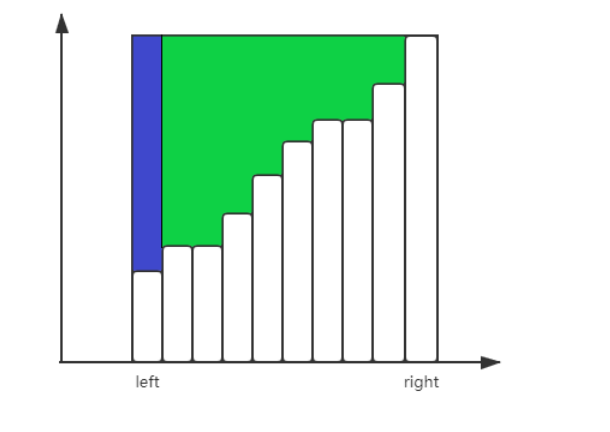

#### [1838. 最高频元素的频数](https://leetcode.cn/problems/frequency-of-the-most-frequent-element/)

难度中等

元素的 **频数** 是该元素在一个数组中出现的次数。

给你一个整数数组 `nums` 和一个整数 `k` 。在一步操作中，你可以选择 `nums` 的一个下标，并将该下标对应元素的值增加 `1` 。

执行最多 `k` 次操作后，返回数组中最高频元素的 **最大可能频数** *。*

 

**示例 1：**

```
输入：nums = [1,2,4], k = 5
输出：3
解释：对第一个元素执行 3 次递增操作，对第二个元素执 2 次递增操作，此时 nums = [4,4,4] 。
4 是数组中最高频元素，频数是 3 。
```

**示例 2：**

```
输入：nums = [1,4,8,13], k = 5
输出：2
解释：存在多种最优解决方案：
- 对第一个元素执行 3 次递增操作，此时 nums = [4,4,8,13] 。4 是数组中最高频元素，频数是 2 。
- 对第二个元素执行 4 次递增操作，此时 nums = [1,8,8,13] 。8 是数组中最高频元素，频数是 2 。
- 对第三个元素执行 5 次递增操作，此时 nums = [1,4,13,13] 。13 是数组中最高频元素，频数是 2 。
```

**示例 3：**

```
输入：nums = [3,9,6], k = 2
输出：1
```

 

**提示：**

- `1 <= nums.length <= 105`
- `1 <= nums[i] <= 105`
- `1 <= k <= 105`


###### 算法分析

题目要求，最大累加次数不能超过K, 保证最高频元素的个数。

（1）先对数组进行排序。

（2）r 表示右边界，l 表示左边界。total 计算数组子数组[r-l]前缀和的差值。

 (3) 




如图 for 循环中每次循环 total 中增加图一中红色的部分

$(nums[r] -nums[r-1]) * (r-l)$。

当不执行while 循环时，说明满足区间$[r,l]$ 元素进行多次累加后出现同频元素，且元素个数为 

$r-l+1$

利用Java 内置函数，取得目前最大同频元素个数

$Math.max( res,r - l + 1 )$

当 $r$ 继续增加，再次循环。

当执行 toatal 值大于K 时，total 减去 图二中 蓝色部分，$l$ 往后移动一位。

本题使用（排序+滑动窗口+前缀和）

（4）for 循环执行一遍，求出数组中最高同频元素个数

##### 解题方法

```java
class Solution {
    public int maxFrequency(int[] nums, int k) {
        Arrays.sort(nums);
        int res =1;
        long total = 0;
        int l = 0;
        for (int r = 1; r < nums.length; r++) {
            total += (long)(nums[r] -nums[r-1]) * (r-l);

            while (total > k){
                total -= nums[r] -nums[l];
                l++;
            }
            res = Math.max( res,r - l + 1 );
        }
        return res;
    }
}
```


#### [1590. 使数组和能被 P 整除](https://leetcode.cn/problems/make-sum-divisible-by-p/)

###### 算法分析

##### 解题方法

#### [1589. 所有排列中的最大和](https://leetcode.cn/problems/maximum-sum-obtained-of-any-permutation/)

###### 算法分析

##### 解题方法


#### [1712. 将数组分成三个子数组的方案数](https://leetcode.cn/problems/ways-to-split-array-into-three-subarrays/)

###### 算法分析

##### 解题方法

